# OrderFlow

WhatsApp order management for restaurants. Customers place orders through a bot conversation, the kitchen tracks and manages everything through a live web dashboard.

---

During my internship at **Blue Ticks Innovations Pvt. Ltd** (incubated at IIT Mandi Catalyst, Himachal Pradesh) I worked on **SupFoodie AI**, a WhatsApp ordering chatbot for restaurants. OrderFlow is a personal version I built on the side with the company's permission. The high-level concept is roughly inspired by that work but this is a seperate codebase written from scratch with a different approach to the architecture, the bot engine, and the dashboard.

**Live:** https://order-flow-omega.vercel.app  
Login: `owner@demo.test` / `Demo@1234`  
Bot simulator slug: `spice-garden`

---

## What it does

Restaurants sign up as tenants. Their customers message a WhatsApp number, the bot walks them through the menu, builds a cart, handles payment (cash or online), and confirms the order. Staff see every incoming order in real time on the dashboard without refreshing anything.

The whole bot conversation is driven by a finite state machine. Each customer session has a state (greeting, browsing, cart, checkout, payment, confirmed) and the engine decides what reply to send and what state to move to next. Multiple customers across multiple restaurants all run through the same engine with completely isolated data.

Real-time updates use Socket.io. When an order comes in through the bot, it appears on the Orders page instantly. Staff can update order status and it reflects back to the dashboard live.

JWT auth uses refresh token rotation. Every time you refresh, the old refresh token is invalidated and a new one is issued. A stolen token can only be used once before it's worthless.

---

## Stack

| Layer | What |
|---|---|
| Backend | Node.js, Express, TypeScript |
| Database | MongoDB + Mongoose |
| Realtime | Socket.io |
| Auth | JWT with refresh token rotation |
| Frontend | React, Vite, Tailwind CSS |
| Charts | Chart.js |
| Tests | Jest + Supertest |
| Deployment | Render (server) + Vercel (dashboard) + MongoDB Atlas |

---

## Running locally

```bash
npm run install:all
npm run dev
```

Dashboard: http://localhost:5173  
API: http://localhost:4000

No MongoDB setup needed. The server starts an in-memory instance automatically in dev mode. Demo data (tenant, menu, accounts) seeds on first run.

Login: `owner@demo.test` / `Demo@1234`

---

## Try the bot

1. Log in, open **Bot Simulator** in the sidebar
2. Tenant slug: `spice-garden`, phone: `+919999999999`
3. Type `hi`
4. Browse the menu, add items, type `checkout`
5. Pick `cod` (cash) or `online` (mock payment link)
6. Switch to the **Orders** page and watch it appear live

---

## Screenshots

### Dashboard and orders

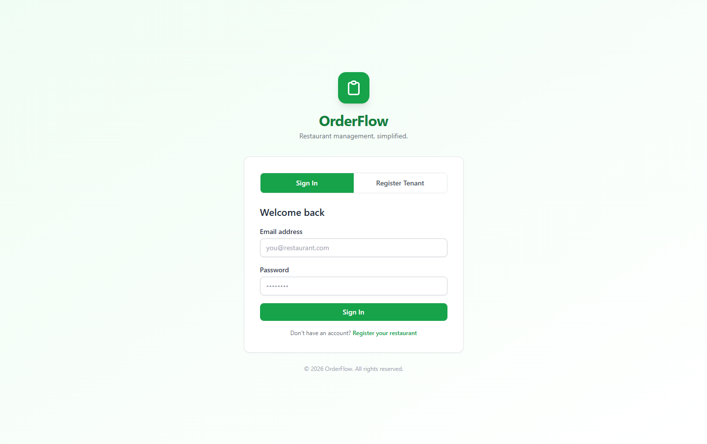

Staff sign in here to access the dashboard. The page is light and dark mode aware and tokens refresh silently in the background.

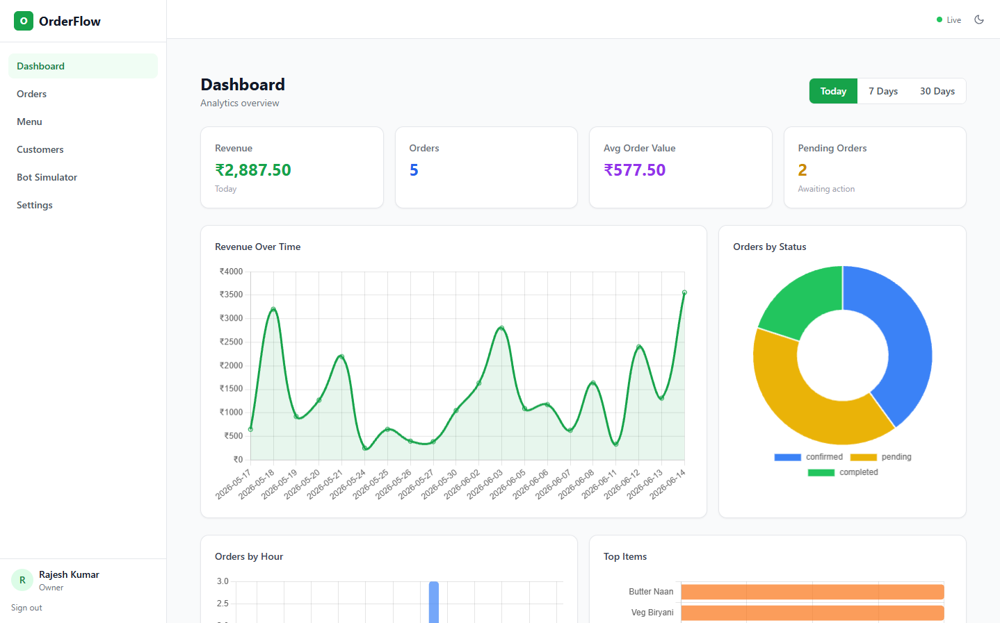

Daily revenue and order counts at a glance. The revenue chart updates as new orders come in throughout the day.

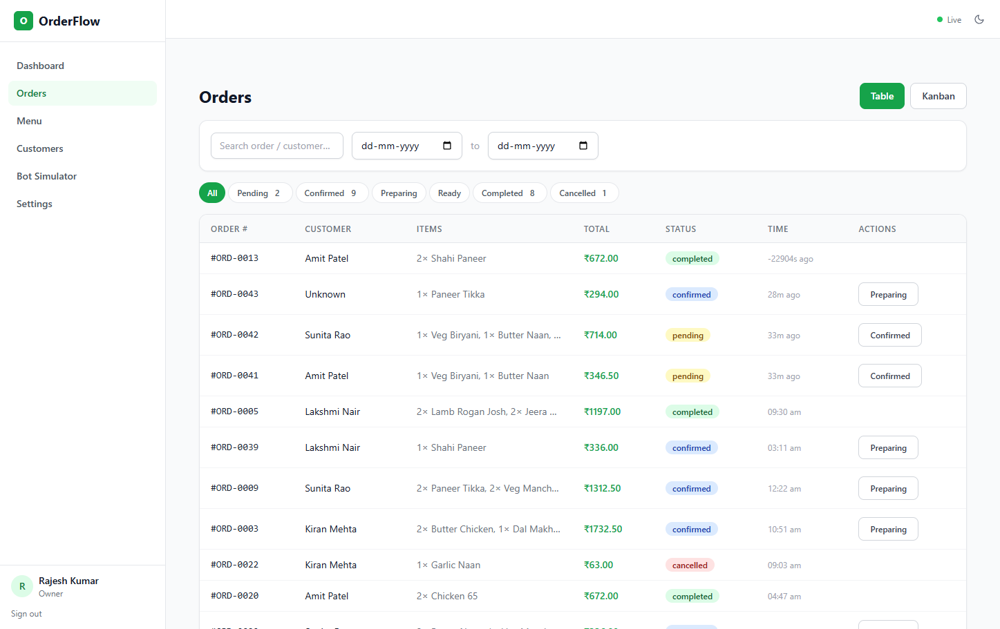

All orders in one place with live status badges, customer names, and timestamps. Filter by status or narrow down by date range from the top bar.

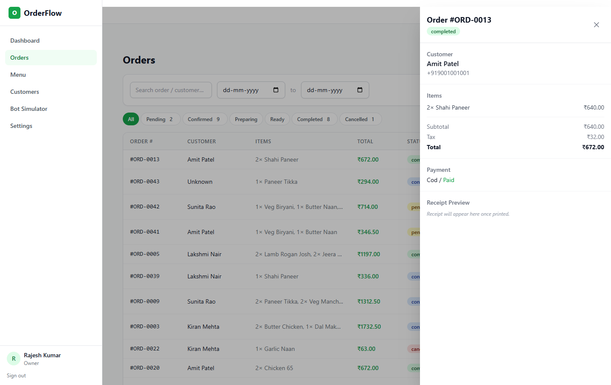

Clicking any row opens this side drawer. Staff can move the order through each stage of the pipeline or cancel it with a reason logged.

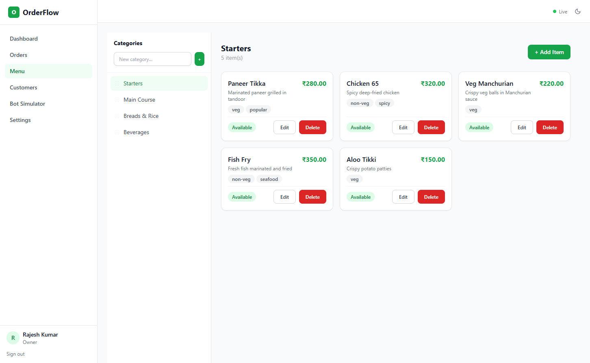

Add and edit menu items, flip them on or off without deleting, and keep them organised by category.

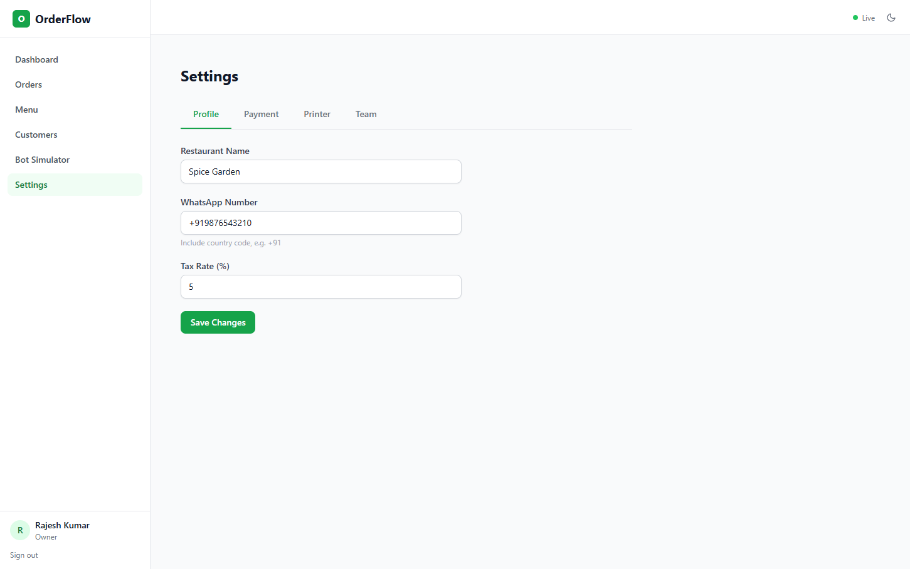

Per-restaurant settings for the profile name, WhatsApp number, and tax rate.

### Bot simulator

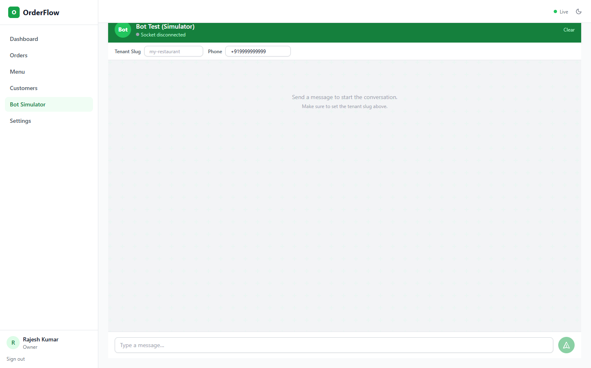

The simulator lives inside the dashboard so any tenant can be tested without needing a real WhatsApp number. Type a slug, enter a phone, and start chatting.

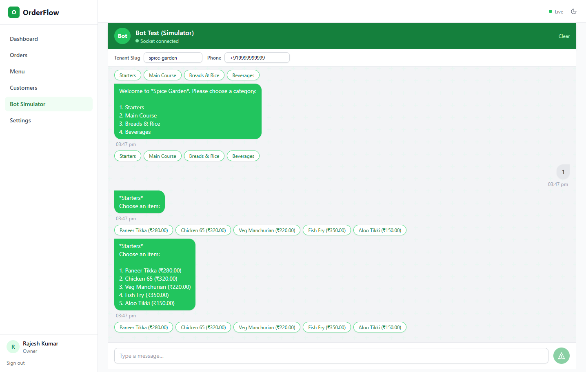

A customer browsing the menu through the bot. The engine walks through categories step by step and builds the cart as items are selected.

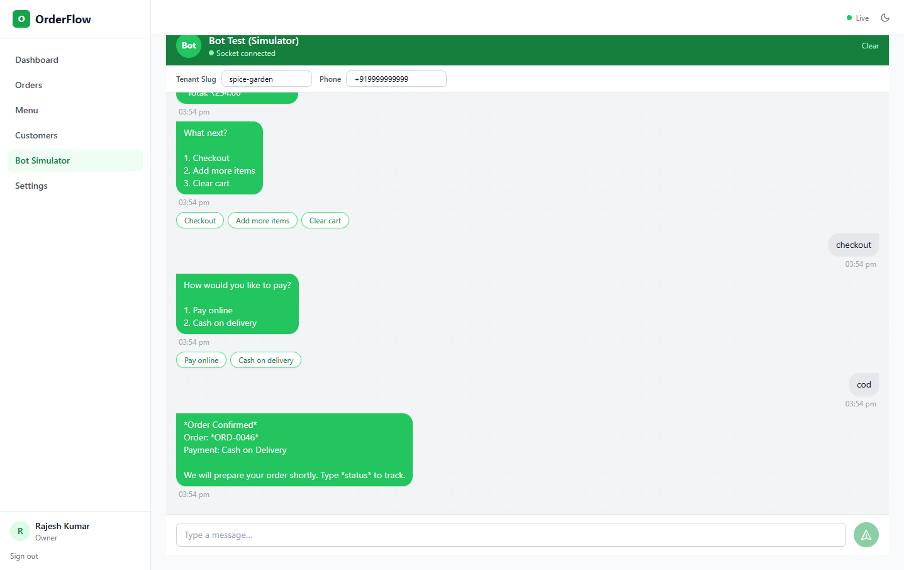

A cash on delivery order being confirmed. The bot sends the order number to the customer and the same order shows up on the orders page in real time without a refresh.

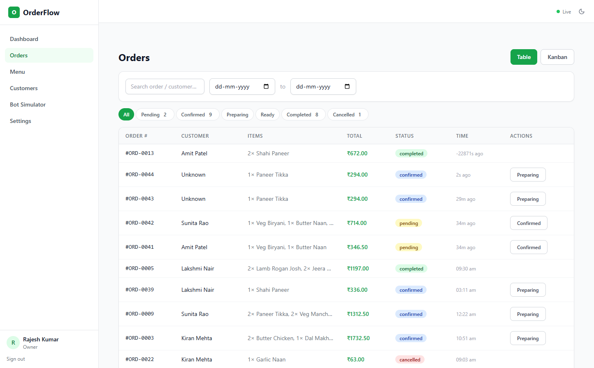

The orders page right after a few simulator runs. The new orders landed here live via Socket.io as soon as the bot confirmed them.

### Infrastructure

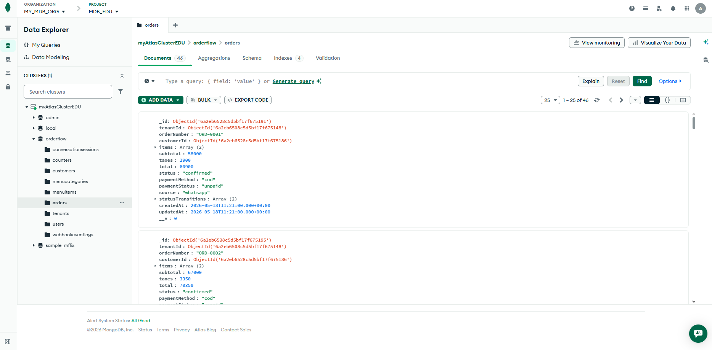

Order documents sitting in the Atlas collection. The Render server writes here on every confirmed order and reads from it on every API request.

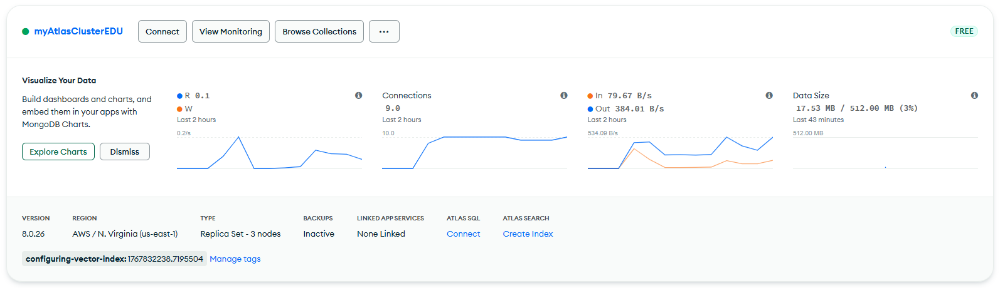

Atlas cluster metrics showing around 9 active connections and 17 MB of data. Running on AWS N. Virginia on the M0 free tier.

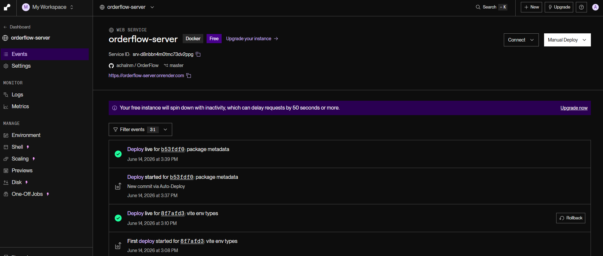

The server deployed to Render as a Docker container. Auto-deploys fire on every push to master and the deploy history stays visible here.

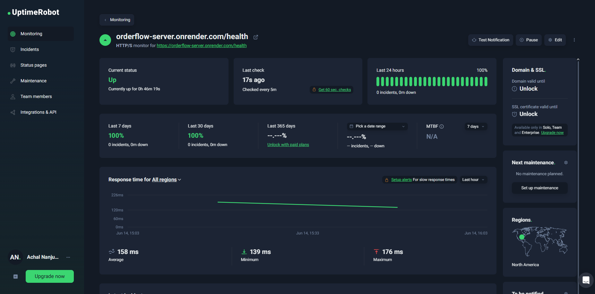

UptimeRobot pinging the health endpoint every 5 minutes so the Render instance stays warm and does not spin down between requests.

---

## Tests

```bash
cd server && npm test
```

27 tests covering: auth flows, RBAC (owner vs manager vs staff), tenant data isolation, order state machine, bot FSM transitions, and webhook idempotency.

---

## Environment variables

Server (`server/.env`):

| Variable | Default | Notes |
|---|---|---|
| `PORT` | `4000` | |
| `MONGODB_URI` | in-memory in dev | Atlas URI in production |
| `JWT_ACCESS_SECRET` | dev default | Change in production |
| `JWT_REFRESH_SECRET` | dev default | Change in production |
| `CORS_ORIGIN` | `http://localhost:5173` | Set to frontend URL in production |
| `CHANNEL` | `simulator` | `simulator`, `whatsapp-webjs`, or `whatsapp-cloud` |
| `PAYMENT_PROVIDER` | `mock` | `mock` or `razorpay` |
| `PRINTER_TYPE` | `mock` | `mock` or `network` (ESC/POS) |
| `BASE_URL` | `http://localhost:4000` | Used in payment links sent by bot |

---

## Switching channels

```bash
# WhatsApp Web.js (scan QR code)
CHANNEL=whatsapp-webjs npm run dev --prefix server

# Meta Cloud API
CHANNEL=whatsapp-cloud WHATSAPP_CLOUD_TOKEN=... npm run dev --prefix server

# Razorpay payments
PAYMENT_PROVIDER=razorpay RAZORPAY_KEY_ID=... RAZORPAY_KEY_SECRET=... npm run dev --prefix server

# ESC/POS network printer
PRINTER_TYPE=network PRINTER_HOST=192.168.1.100 PRINTER_PORT=9100 npm run dev --prefix server
```

---

## Structure

```
orderflow/
├── server/src/
│   ├── bot/            FSM engine
│   ├── channels/       simulator, WhatsApp Web.js, Cloud API
│   ├── routes/         REST API
│   ├── services/       business logic
│   ├── models/         Mongoose schemas
│   ├── payments/       mock, Razorpay
│   ├── printer/        mock, ESC/POS
│   ├── middleware/     auth, error handling
│   └── __tests__/      Jest suites
└── dashboard/src/
    ├── pages/          Dashboard, Orders, Menu, Customers, Simulator, Settings
    ├── context/        Auth, Socket
    └── api/            Axios client
```
